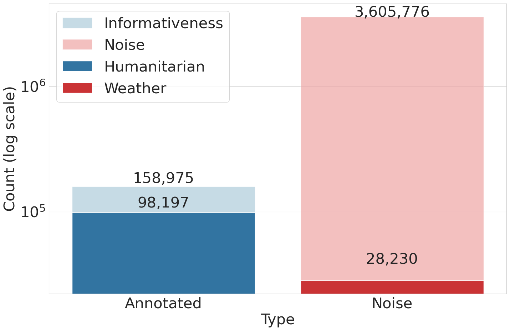
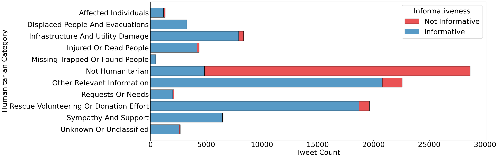
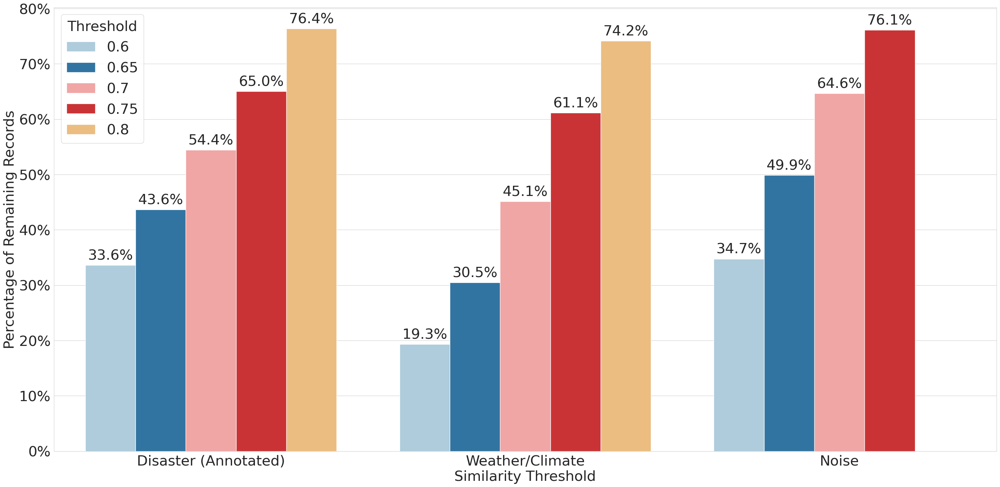

# CrisisLiveTxt-Dataset - A Large-Scale Crisis-related Dataset for Humanitarian Information Detection on Social Media

> We briefly describe our work for a non-technical audience to promote the project's `AI for good` purpose.
>
> For expert and scientific readers, we will publish our article once we confirm the conference venue.

## A. Overview

Detecting and classifying crisis-related event information on social media is crucial for humanitarian operations. Our work is building a Large-Scale dataset that simulates real-world scenarios and creating a multi-stage pipeline classifier for addressing the task:

### A.1. The CrisisLiveTxt Dataset

- Gathering and selecting 158,975 records from 14 previous crisis-related annotated datasets.
- Mix with another 11 noise datasets from Twitter, which contain a similar topic to the crisis-related dataset, then the total number of datasets is 3,605,776 records.
- We applied semantic similarity for a high-quality dataset by preventing data leakage.

### A.2. The Cascade Classifier Pipeline

- We apply cascading classification by fine-tuning BERT and Llama models for a multi-stage classifier. Technique for Imbalanced Data and Parameter-Efficient Fine-Tuning
(PEFT) were applied, such as FocalLoss and QLoRA.

> We cannot publish the dataset temporarily because we are in the publication process and subject to the [X Developer Agreement](https://docs.x.com/developer-terms/agreement).

## B. The datasets

A few distributions of Class in the Dataset are shown in the figures below:

*Figure 1: The Distribution of Crisis-related annotated tweets and Noise*

*Figure 2: The Classes Distribution of Humanitarian Crisis-related tweets*

Notes:

- Informativeness means whether the tweet contains useful information about a crisis or not, and is annotated by a human.
- Noise means a tweet that is not related to or close to the topic (i.e., weather)

The challenges of the task are how to precisely detect Humanitarian Information from a massive amount of Noise and Related but non-informative data, and how to classify it into the correct category accurately. To demonstrate the issue, let's consider the example:

- In our Dataset, for every `Informative` tweet, there are another 40 `Non-informative`.
- If the model classifies ALL tweets as `Non-informative`, the model correctly classifies 40 tweets and is wrong at only one. It means the accuracy is $40/41 = 97.56\%$!!!.
- The result is high, but totally not usable for the task.

### Cleaning steps

The crucial step of any AI model is data processing. In addition to basic cleaning steps such as deduplication, we also apply semantic filtering to remove similar tweets during training and evaluation to prevent [data leakage](https://en.wikipedia.org/wiki/Leakage_(machine_learning)). Think about a student who practiced a question that will appear again in the exam; he can easily solve it, but we cannot say he knows how to solve it or that he is just remembering the answer.

And we do not simply filter by `Lexical` (word comparison) but by the `Semantic` meaning. For example:

| No. | Sentence | Lexical | Semantic |
| -: | :- | :- | -: |
| 1 | Help! Trapped on the second floor! #flood | - | - |
| 2 | The bird is trapped on the second floor. | 0.754 × | 0.444 |
| 3 | I am stuck upstairs. Need rescue from the flood! | 0.128 | 0.729 ✓ |

*Table 1. The Classes Distribution of Humanitarian Crisis-related tweets*

The higher the number, the higher the similarity. If we compare the sentence `1` with the sentences `2` and `3`. If we filter only by exact word comparisons (lexical), the output is undesirable.

To do that with large-scale data and leverage GPU optimizations, we use [FAISS](https://github.com/facebookresearch/faiss), a library from META for efficient similarity search and clustering of dense vectors.

#### Figure 3: Noise filtering by different Thresholds

## C. The pipeline

To deal with the issue, we apply a multi-stage classification as follows:

*Figure 4: The Classes Distribution of Humanitarian Crisis-related tweets*

Each model is fine-tuned to solve smaller challenges in each stage:

- [BERT](https://huggingface.co/docs/transformers/en/model_doc/bert) focuses on filtering a massive amount of noise using the `recall` metric.
- [Llama. 3.2-3B-base](https://huggingface.co/zai-org/GLM-5.2) in stage 2 for the `precision` metric, which accurately classifies in much less noisy data.
- [Llama. 3.2-3B-base](https://huggingface.co/zai-org/GLM-5.2) in stage 3 for final Humanitarian classification.

Because our focus is on large-scale data, effectiveness is also an important metric, and an appropriate model size is required.

We also use the `base` version instead of `instruct` for the expected behavior and generated result, rather than the conversation style.

The final result is in Table 2 below, with a 02 difference in the way the data is split.

| Class / Metric | Strategy | P | R | F1 | S |
| :--- | :--- | :---: | :---: | :---: | :---: |
| Displaced People & Evacuations | Stratified | 0.8094 | 0.7923 | **0.8007** | 284 |
| | Filtered | 0.7687 | 0.8043 | **0.7861** | 281 |
| Infrastructure & Utility Damage | Stratified | 0.7604 | 0.6952 | **0.7264** | 735 |
| | Filtered | 0.7756 | 0.7331 | **0.7538** | 712 |
| Injured or Dead People | Stratified | 0.8616 | 0.7611 | **0.8083** | 360 |
| | Filtered | 0.8286 | 0.8333 | **0.8309** | 348 |
| Missing, Trapped, or Found | Stratified | 0.5581 | 0.5333 | **0.5455** | 45 |
| | Filtered | 0.5745 | 0.6279 | **0.6000** | 43 |
| Not Humanitarian | Stratified | 0.4061 | 0.7175 | **0.5187** | 977 |
| | Filtered | 0.4494 | 0.6190 | **0.5208** | 861 |
| Other Relevant Information | Stratified | 0.6575 | 0.5008 | **0.5686** | 1775 |
| | Filtered | 0.6252 | 0.5970 | **0.6108** | 1665 |
| Requests or Needs | Stratified | 0.5959 | 0.4328 | **0.5014** | 201 |
| | Filtered | 0.5879 | 0.5449 | **0.5656** | 178 |
| Rescue, Volunteering, or Donation | Stratified | 0.8283 | 0.7700 | **0.7981** | 1917 |
| | Filtered | 0.8476 | 0.7402 | **0.7903** | 1863 |
| Sympathy & Support | Stratified | 0.7237 | 0.6937 | **0.7084** | 555 |
| | Filtered | 0.7241 | 0.7487 | **0.7362** | 561 |
| Accuracy | Stratified | - | 0.6675 | - | 6849 |
| | Filtered | - | 0.6892 | - | 6512 |
| Macro Average | Stratified | 0.6890 | 0.6552 | **0.6640** | 6849 |
| | Filtered | 0.6868 | 0.6943 | **0.6883** | 6512 |
| Weighted Average | Stratified | 0.7004 | 0.6675 | **0.6741** | 6849 |
| | Filtered | 0.7062 | 0.6892 | **0.6947** | 6512 |

*Table 2. Humanitarian Classification result. `P` is `Precision`; `R` is `Recall`; and `S` is `Support`.*

Our result achieves performance similar to other reference methods. And set up a baseline for future studies.

### Imbalancing Technique

We apply [FocalLoss](https://ieeexplore.ieee.org/document/8417976) for Stage 1 and Stage 3, due to a severe imbalance, while [WeightedLoss](https://docs.pytorch.org/docs/2.12/generated/torch.nn.CrossEntropyLoss.html) for Stage 2, which has much less imbalance. This will penalize the model if it makes a simple prediction that every tweet is in the major class.

### Fine-Tunig

BERT is a small model (~110 million parameters) in the current landscape, so that we can fine-tune the whole model

For Llama (3.07 billion parameters) fine-tuning all parameters is computationally
expensive and can lead to side effects. We apply [Quantized Low-Rank Adaptation (QloRA)](https://github.com/artidoro/qlora), a [Parameter-Efficient Fine-Tuning (PEFT)](https://huggingface.co/docs/peft/en/index) technique that updates only a small portion of the parameters during the fine-tuning process.
